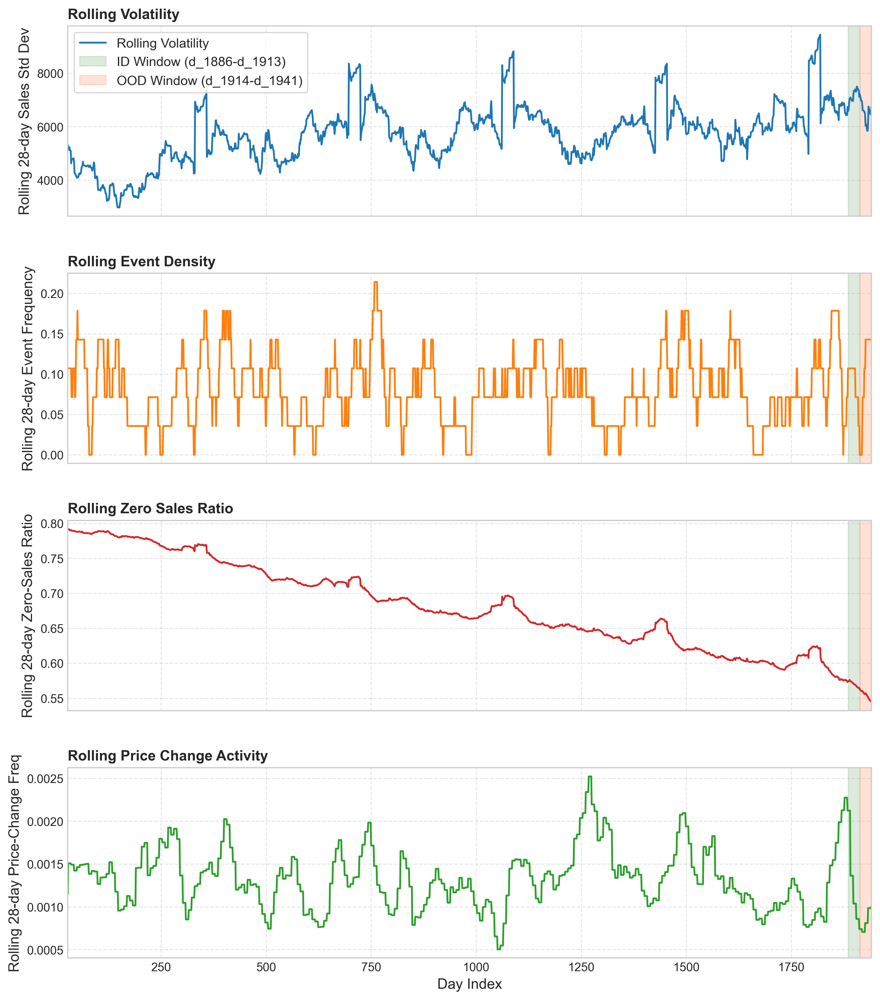
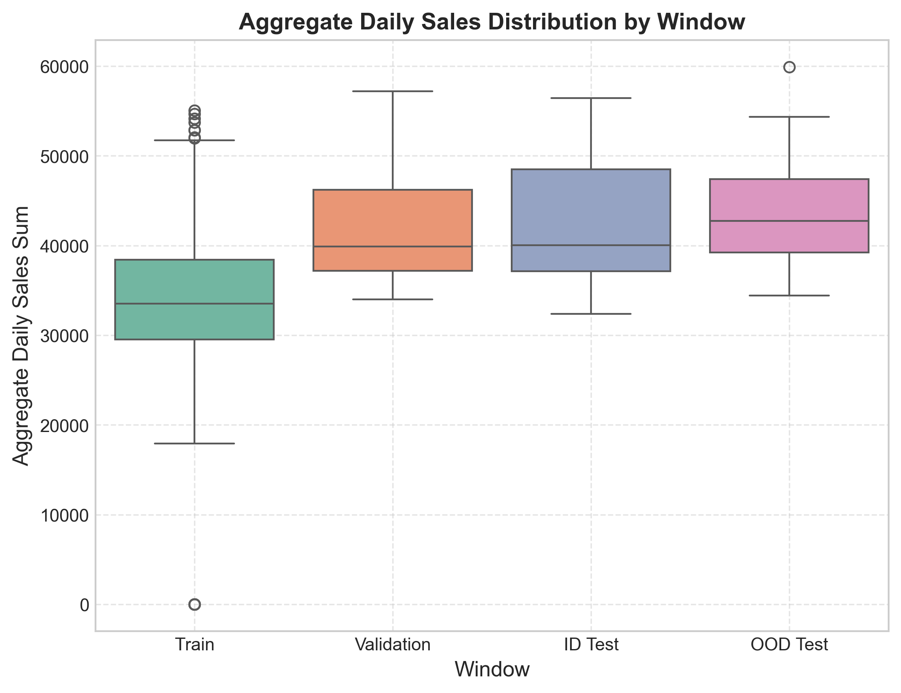
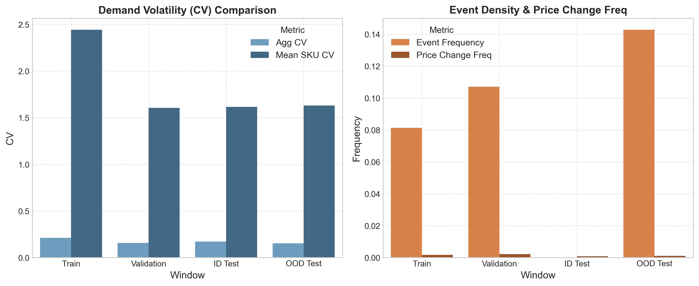

# Focused EDA for ID/OOD Scenario Design (M5 Forecasting)

This report characterizes the temporal demand behavior of the M5 dataset across predefined, chronologically structured evaluation windows. The analysis supports the thesis methodology and results sections, establishing the justification for the **OOD temporal scenario** (or **temporally shifted retail evaluation scenario**) without claiming any severe or extreme distribution shift.

---

## Predefined Evaluation Windows

By chronological design, the dataset is partitioned into four distinct periods. This structure preserves the temporal ordering of data, avoids leakage, and establishes evaluation windows matching the standard M5 forecasting horizon of 28 days:

| Window | Day Range | Start Date | End Date | Duration (Days) | Description |
| :--- | :--- | :--- | :--- | :--- | :--- |
| **Train** | `d_1` – `d_1857` | 2011-01-29 | 2016-02-28 | 1857 | Long-term historical baseline |
| **Validation** | `d_1858` – `d_1885` | 2016-02-29 | 2016-03-27 | 28 | Near-future tuning phase |
| **ID Test** | `d_1886` – `d_1913` | 2016-03-28 | 2016-04-24 | 28 | Ordinary near-future test window |
| **OOD Test** | `d_1914` – `d_1941` | 2016-04-25 | 2016-05-22 | 28 | Temporally shifted retail scenario |

---

## Predefined Window Characterization

The window statistics are calculated across four primary signals: event exposure/calendar intensity, volatility, zero-sales intermittency, and pricing activity.

### Summary Comparison Table
| Metric | Train (`d_1`–`d_1857`) | Validation (`d_1858`–`d_1885`) | ID Test (`d_1886`–`d_1913`) | OOD Test (`d_1914`–`d_1941`) |
| :--- | :---: | :---: | :---: | :---: |
| **Agg. Daily Mean Sales** | 34,106.47 | 42,002.39 | 42,272.36 | 43,991.57 |
| **Agg. Daily Median Sales** | 33,518.00 | 39,884.50 | 40,050.50 | 42,724.00 |
| **Agg. Daily Std. Dev.** | 7,232.88 | 6,569.96 | 7,220.30 | 6,759.78 |
| **Agg. Daily CV** | 0.2121 | 0.1564 | 0.1708 | 0.1537 |
| **Mean SKU-level CV** | 2.4433 | 1.6062 | 1.6157 | 1.6302 |
| **Zero-Sales Ratio** | 0.6854 | 0.5741 | 0.5628 | 0.5444 |
| **Active SKU Ratio** | 1.0000 | 0.9295 | 0.9480 | 0.9734 |
| **Event Frequency** | 0.0813 | 0.1071 | **0.0000** | **0.1429** |
| **SNAP Frequency** | 0.3285 | 0.3571 | 0.3571 | 0.3571 |
| **Holiday Count** | 102 | 1 | **0** | **2** |
| **Avg. SKU Price CV** | 0.0321 | 0.0021 | **0.0011** | **0.0016** |
| **Price Change Freq.** | 0.0017 | 0.0022 | **0.0008** | **0.0010** |

---

## Characterization of the OOD Temporal Scenario

The OOD test window (`d_1914` to `d_1941`) displays distinct, predefined signals that distinguish it from the ordinary ID test window (`d_1886` to `d_1913`), justifying its role as a **temporally shifted retail evaluation scenario**:

1. **Event Exposure & Calendar Intensity**:
   * The **ID Test window is completely event-free** (Event Frequency = `0.0000`, Holiday Count = `0`).
   * The **OOD Test window has high calendar intensity** (Event Frequency = `0.1429`, Holiday Count = `2`). It spans several notable events including Orthodox Easter, Cinco de Mayo, and Mother's Day, which typically trigger shifts in shopping behaviors and demand spikes.
2. **Pricing Activity**:
   * The price change frequency in the OOD window is **35.1% higher** than in the ID window (`0.001037` vs `0.000768`), indicating heightened retail promotional activity.
   * The average SKU-level price variation (CV) is **35.8% higher** in the OOD window (`0.001551` vs `0.001142`), reflecting dynamic price shifts during the event-heavy period.
3. **Demand Volatility & Sales Activity**:
   * While the aggregate daily CV in OOD is slightly lower (`0.1537` vs `0.1708`), the average individual SKU-level volatility (Mean SKU CV) is slightly higher (`1.6302` vs `1.6157`).
   * The OOD window exhibits a higher SKU active ratio (`0.9734` vs `0.9480`) and a lower zero-sales ratio (`0.5444` vs `0.5628`), indicating a period of broader purchase engagement across the catalog.

---

## Descriptive Shift Metrics (vs. Training Window)

To further document the shift characteristics, we present standard distribution shift metrics compared to the historical baseline (Training Window):

| Comparison (vs. Train) | Level | Mean Diff. | Var. Diff. | Rel. Volatility Diff. | KS Statistic | Wasserstein Dist. |
| :--- | :--- | :---: | :---: | :---: | :---: | :---: |
| **Train vs. ID Test** | Aggregate (Daily Sum) | +8,165.89 | -181,942.19 | -0.17% | 0.5042 | 8,165.89 |
| **Train vs. OOD Test** | Aggregate (Daily Sum) | +9,885.10 | -6,619,947.14 | -6.54% | 0.5839 | 9,885.10 |
| **Train vs. ID Test** | SKU-level (Subsample) | +0.2606 | -3.62 | — | 0.2070 | 0.7848 |
| **Train vs. OOD Test** | SKU-level (Subsample) | +0.3081 | -3.30 | — | 0.2097 | 0.7869 |

*Note: SKU-level statistics represent the average across a representative random subsample of 3,000 series. At the aggregate level, the OOD test window exhibits a larger Kolmogorov-Smirnov (KS) statistic (0.5839 vs 0.5042) and a greater Wasserstein distance (9,885.10 vs 8,165.89) relative to the training baseline, matching the descriptive shift behavior.*

---

## Visualizations

### 1. Rolling Temporal Metrics
This dashboard displays rolling 28-day temporal statistics over the entire historical range (from day 28 to day 1941). The ID and OOD windows are shaded in green and red respectively, illustrating how the metrics evolve dynamically over time:

### 2. Aggregate Daily Sales Distributions
This boxplot compares the daily sales sum distribution across all four chronological partitions, illustrating the shift in mean daily demand:

### 3. Window Characterization Metrics
These bar charts compare key volatility and calendar/price density indicators, highlighting the event exposure and pricing changes characterizing the OOD window:

